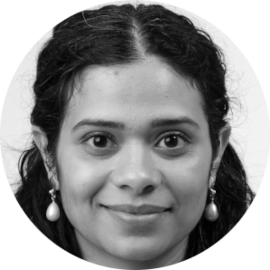
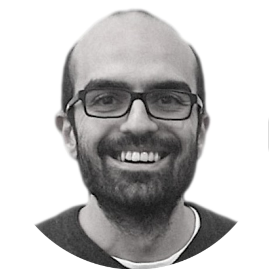
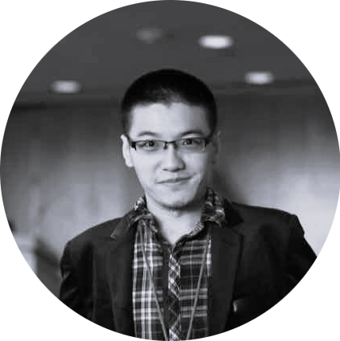
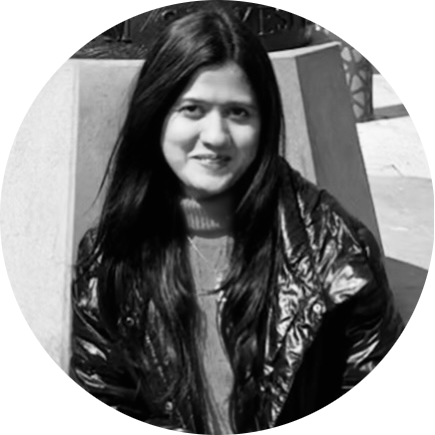

# Teaching Staff {.unnumbered}

#### [Kavin Narasimhan](https://warwick.ac.uk/fac/cross_fac/cim/people/kavin-narasimhan/)

 *Assistant Professor*

Agent-based Modelling, Computational Modelling for Public Policy, Network Analysis, and Participatory Research Methods are my areas of research interest and expertise. I continue to work at the intersection of academic research and public policy through which I see firsthand the impact of reliable data analysis and effective story telling using data on decision-making.
#### [Cagatay Turkay](https://warwick.ac.uk/fac/cross_fac/cim/people/cagatay-turkay)

 *Professor, Module Convener*

My research falls under the broad area that can be referred to as Visual Data Science and focuses on designing visualisations, interactions and computational methods to enable an effective combination of human and machine capabilities to facilitate data-intensive problem solving.
I have a special interest in working on problems where high-dimensional, spatio-temporal, heterogenous and large datasets are used in answering questions with data.

#### [Ching Jin](https://warwick.ac.uk/fac/cross_fac/cim/people/ching-jin/)

 *Assistant Professor*

I am a computational social scientist, who specializes in developing novel computational methodologies by leveraging tools from network science, statistical physics, and artificial intelligence. My work involves applying these methods to large-scale datasets across various domains, including technology, science, and commerce, with the overarching goal of describing, modeling, and predicting social patterns.

#### [Esha Sadia Nasir](https://warwick.ac.uk/fac/cross_fac/cim/people/eshasadianasir/)

 *Research Software Engineer*

I am pursuing a PhD in Computer Science at the University of Warwick, specializing in Multiplex Immunofluorescence image processing and analysis. My research interests span across Computer Vision, Medical Image Analysis, Computational Pathology, Data Analytics, Deep Learning, and Artificial Intelligence.

## Support staff

#### [Carlos Cámara-Menoyo](https://warwick.ac.uk/fac/cross_fac/cim/people/carlos-camara)

 *Senior Research Software Engineer*

I am a versatile, transdisciplinary, and passionate person with a mixed technical and sociological background. As a Senior Research Software Engineer, I am responsible to support research and teaching by using and developing research software while promoting an open, reproducible research culture and outputs.

## Present and former staff {#sec-staff-all}

This module has also been taught by the following people in the past (in alphabetical order):

-   **Cagatay Turkay**, Professor (2020-Present)
-   **Carlos Cámara-Menoyo**, Senior Research Software Engineer (2022-Present)
-   **Ching Jin**, Assistant Professor (2024-Present)
-   **Esha Nasir**, Research Software Engineer (2024-Present)
-   **James Tripp**, Senior Research Software Engineer (2020-2022)
-   **Kavin Narasimhan**, Assistant Professor (2023-Present)
-   **Busola Oronti**, Teaching Assistant (2022-2023)
-   **Yulu Pi**, Teaching Assistant (2022-2023)
-   **Maria Petrescu**, Teaching Assistant (2021-2022)
-   **Zofia Bednarowska-Michaiel**, Teaching Fellow (2021-2022)

We would like to thank them all for their contributions to the module, some of which are also reflected in these materials.
